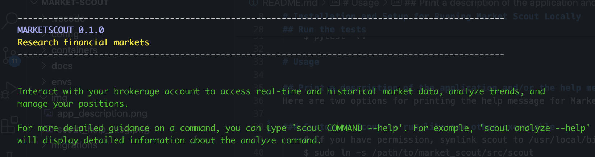

# Market Scout v0.1.0
### A command-line tool for retrieving and representing market data

# Introduction 

This application, MARKET SCOUT, is designed to retrieve real-time and historical market data from a supported brokerage service API.

# Installation and Setup for Running Market Scout Locally
Here are the steps to run Market Scout from the command-line in your local environment. 
    
## Extraction: 
Clone the repo or download and extract all files to a location on your filesystem.
## CD to your project root and create a virtual environment: 
    # this command will create a Python 3.12 venv in your project root
    # conda is used in this example but any package manager will work
    $ cd ../path/to/market_scout
    $ conda create --prefix ./envs python=3.12
## Activate your virtual environment
    # from the project root
    $ conda activate ./envs
## Install dependencies:
    # from project root, pip install dependencies defined in requirements.txt
    $ pip install -r requirements.txt
## Modify PYTHONPATH for the interpreter in your virtual environment:
    # from project root, source the export_python_path helper script 
    # this tells the interpreter where to find custom modules so it can properly import them:
    $ source ./market_scout/helper_scripts/export_python_path.sh
## Run the tests
    # change to the test directory and run pytest. It will "discover" tests and run them
    $ cd test/
    $ pytest -vv

# Usage

## Print a description of the application and/or the help message
Here are two options for printing the help message for Market Scout

### Customize Scout to run like any other executable
    # If you have permission, symlink scout to /usr/local/bin/scout
    $ sudo ln -s /path/to/market_scout/src/scout

### Run Scout to get Description
    # be sure your virtual environment is activated
    $ scout



### Print help message
    # be sure your virtual environment is activated
    # change to project root and run the helper script
    $ cd/market_scout/
    $ scout --help


## Spin up an instance of the Flask development server
1. Make sure you have activated your virtual environment:
    ```
    $ conda activate ./envs
    ```
   or
    ```
    $ source ./envs/bin/activate
    ```
2. Change to the directory containing your Flask application:
    ```
    $ cd ./market_scout/src/api
    ```
3. Run the Flask development server (replace "app.py" with your Flask entry point if it differs):
    ```
    $ flask run --host=0.0.0.0 --port=5000
    ```
   or:
    ```
    $ python app.py
    ```

# Running with Docker
Here are the steps to build the Market Scout container and run it

## Make sure docker is installed
    $ docker --version

## Build the docker image
    # cd to project root and run docker build
    $ cd ../market_scout/
    $ docker build -t Dockerfile -f ./containers/Dockerfile .

## Run the container
    # the Dockerfile has an ENTRYPOINT that points to market_scout/src/scout.py
    # running a container from this image will automatically execute the script
    $ docker run --name Dockerfile market-scout

## Run Interactively
    # to inspect output files in the container, run unit tests, or the api/app.py
    # run the container interactively and override the ENTRYPOINT
    # map port '5000' of the host to port '5000' of the container
    $ docker run -it -p 5000:5000 --entrypoint /bin/bash --name market_scout_container market-scout

Now, if ./api/app.py is run inside the container, you should be able to access the service from
your machine's browser or using a curl command from the terminal


# Functionality
    - Retrieves real-time and historical market data

